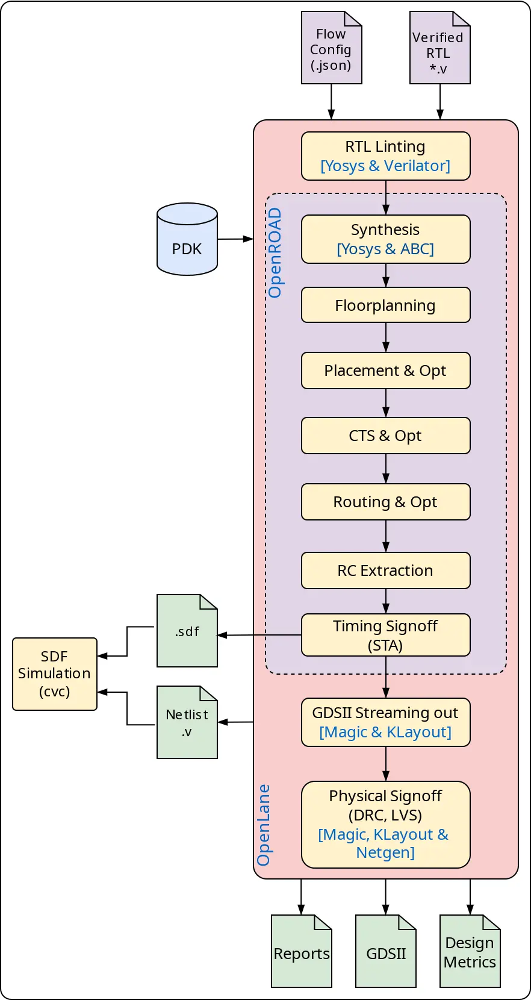
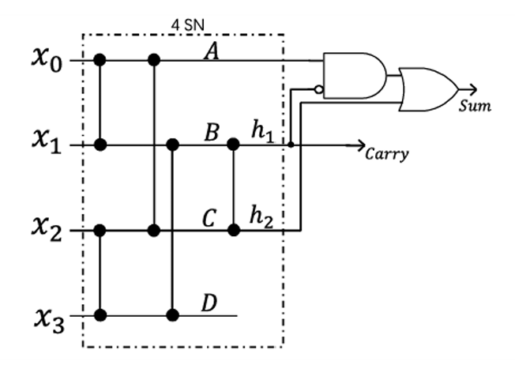
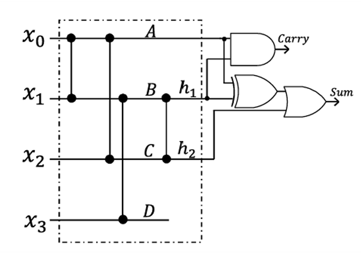
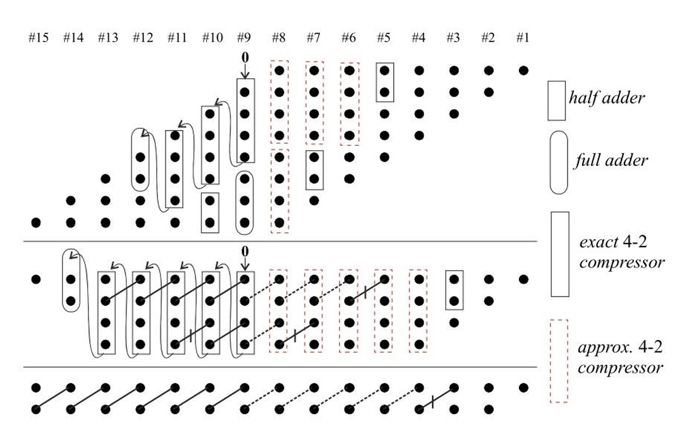
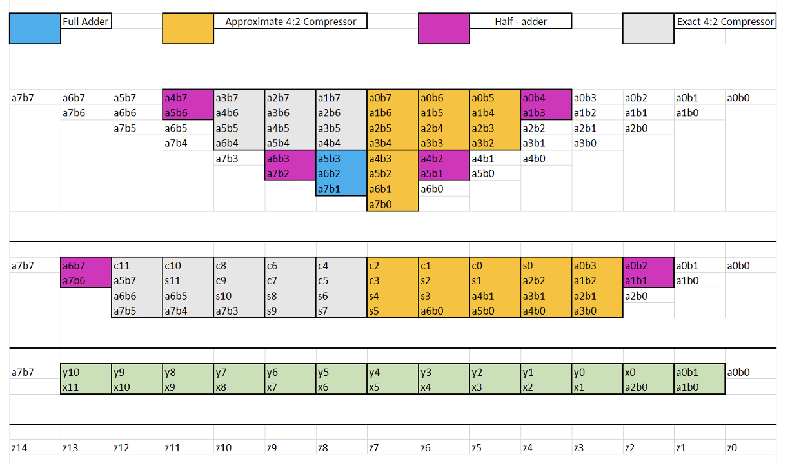
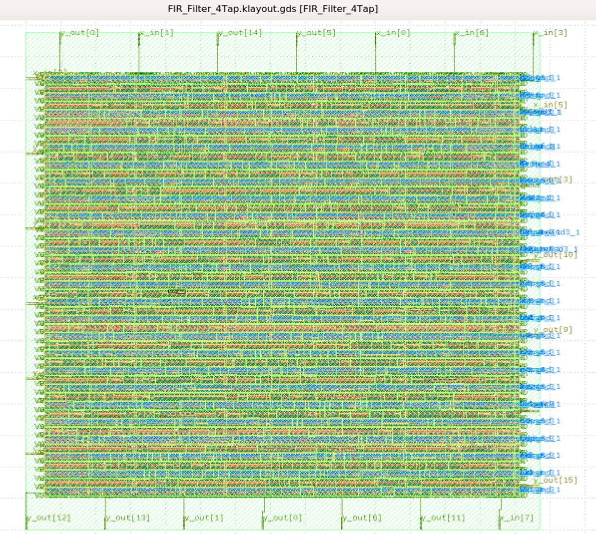
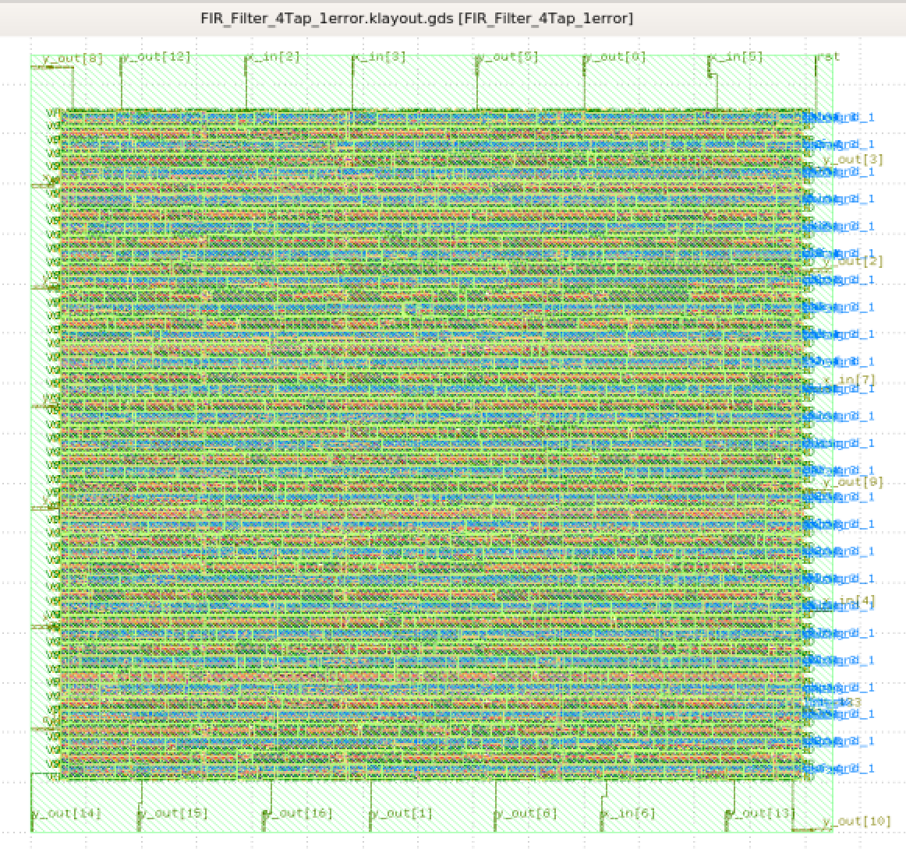
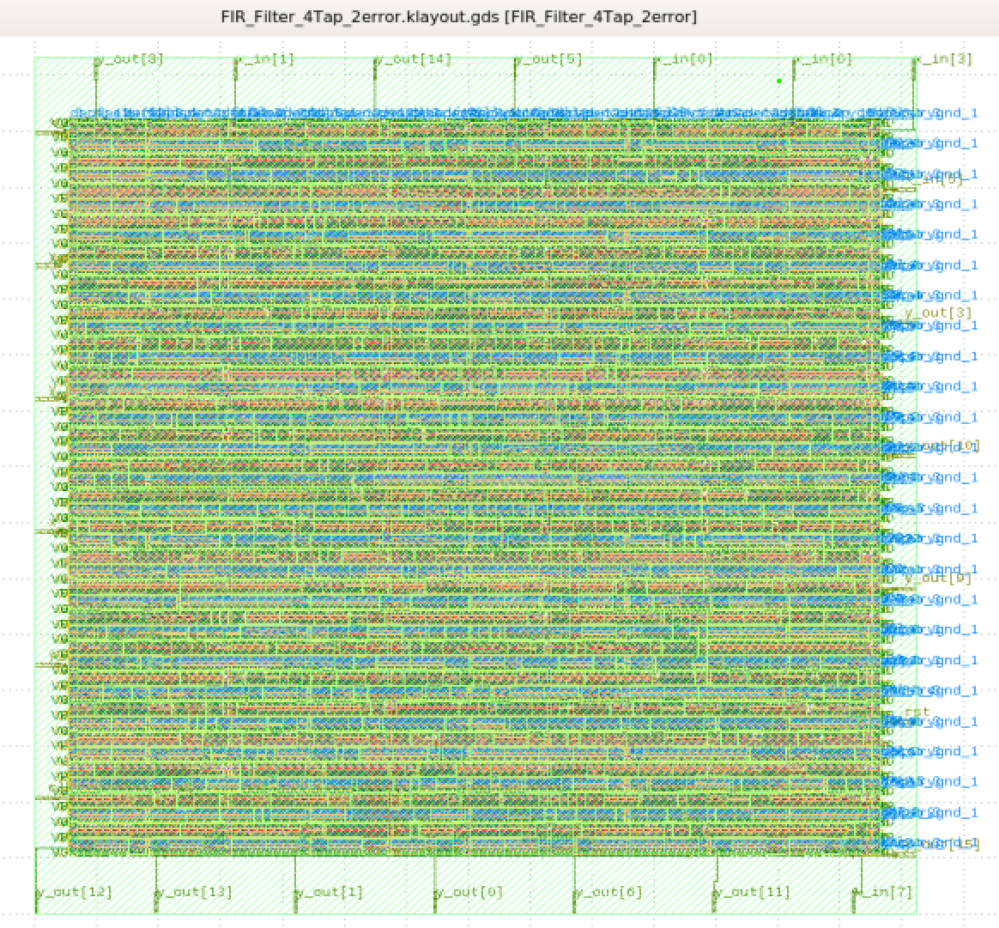
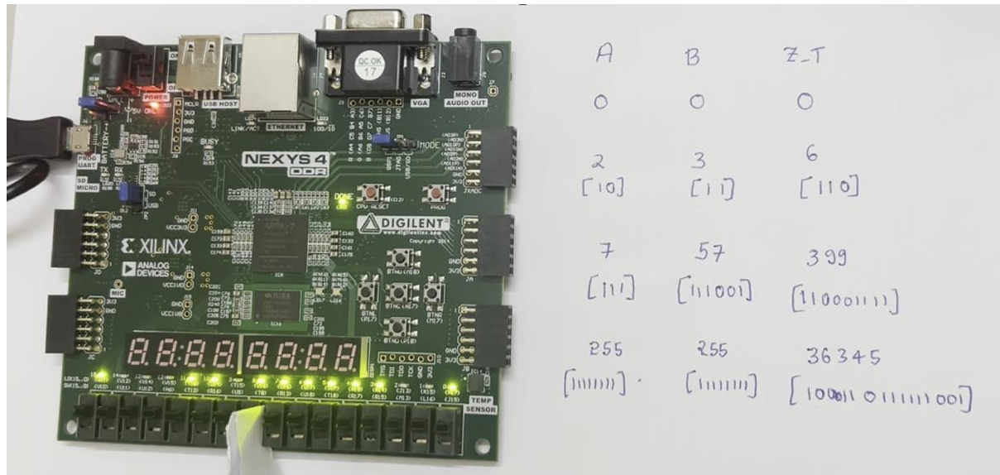
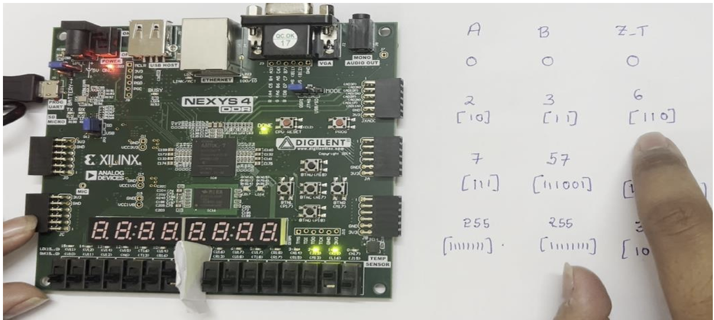

<div align="center">

# Hybrid-Approx-FIR-ASIC: RTL to GDSII

</div>

<div align="center">


*Hardware Implementation and VLSI Analysis of Approximate Compressors for FIR Filters*

[Overview](#-overview) • [Architecture](#-architecture) • [Results](#-results) • [Getting Started](#-getting-started) • [Documentation](#-documentation)

---

</div>

## 🎯 Overview

This project presents a **complete hardware implementation** of Approximate 4:2 Compressors based on sorting networks. Designed for Finite Impulse Response (FIR) filters and Multiplier-Accumulator (MAC) units, this repository explores the critical intersection between **architectural theory and physical silicon reality**. 

While approximate computing theoretically reduces area and power by minimizing logic gates, this project proves that physical hardware constraints—specifically CMOS routing overhead and complex gate penalties—can completely upend those theoretical models.

### ✨ Key Highlights

- 🚀 **Dual-Domain Validation**: Proven on both FPGA (Utilization/Power) and ASIC architectures.
- 🎨 **Open-Source Flow**: Complete RTL-to-GDSII implementation using SkyWater 130nm PDK and OpenLane.
- 🔬 **The "XOR Trap" Discovery**: Identified and resolved a critical CMOS standard-cell bottleneck.
- 📊 **Pareto Optimization**: Established a definitive trade-off frontier between Area, Speed, and Power.
- ⚙️ **High-Speed Logic**: Utilized AOI (AND-OR-Invert) standard cell mapping to achieve a 5.54 ns critical path.

---

## 🏗 Architecture

### Design Hierarchy 

## 🎛️ Top-Level Architecture: 4-Tap FIR Filter

While the core focus of this project is the approximate 4:2 compressors, they are practically implemented and evaluated within the context of a **4-Tap Direct-Form Finite Impulse Response (FIR) Filter**. 

The FIR filter acts as the top-level testing ground for the approximate multipliers. It consists of three main stages:

1. **Delay Line (Shift Registers):** The 8-bit input signal (`x_in`) is passed through a chain of three D-flip-flop delay registers (`x1`, `x2`, `x3`) on each positive clock edge.
2. **Approximate Multiplier Array:** Four 8x8 multipliers operate in parallel. Each multiplier takes one delayed input signal and multiplies it by a fixed, positive stress-test coefficient (`h0`, `h1`, `h2`, `h3`). **This is where the Exact, 1-Error, or 2-Error compressor logic is instantiated.**
3. **Accumulation (Adder Tree):** The 16-bit outputs from the four multipliers (`m0`, `m1`, `m2`, `m3`) are summed together to produce the final filtered output (`y_out`).

```text
       x_in ──┬────────►[ Z⁻¹ ]──┬────────►[ Z⁻¹ ]──┬────────►[ Z⁻¹ ]──┐
              │                  │                  │                  │
              ▼                  ▼                  ▼                  ▼
            ( M0 )             ( M1 )             ( M2 )             ( M3 )  ◄── Approximate Multipliers
              ▲                  ▲                  ▲                  ▲
              │                  │                  │                  │
              h0                 h1                 h2                 h3
              │                  │                  │                  │
              └────────┬─────────┴────────┬─────────┴────────┬─────────┘
                       │                  │                  │
                       ▼                  ▼                  ▼
                     [ + ] ◄────────────[ + ] ◄────────────[ + ]  ◄── Adder Tree
                       │
                     y_out
```
The approximate compressors are built upon 4-way sorting networks. By selectively removing sorting elements, 
we trade mathematical precision for physical hardware efficiency.
```text
┌─────────────────────────────────────────────────────────┐
│                    INPUT SIGNALS                        │
│                 x1, x2, x3, x4, Cin                     │
└─────────────────┬───────────────────────────────────────┘
                  │
         ┌────────▼────────┐
         │ 4-WAY SORTING   │ ◄── Exact: Full sorting
         │    NETWORK      │ ◄── 1-Error: 5 Sorters
         │                 │ ◄── 2-Error: 4 Sorters
         └────────┬────────┘
                  │
         ┌────────▼────────┐
         │  OUTPUT LOGIC   │ ◄── Reconstructs Sum & Carry
         │ (AND / OR / XOR)│     The "XOR Trap" occurs here
         └─────────────────┘
                  │
           Sum ◄──┴──► Carry
```

### ⚙️ Compressor Variants

1. **Exact 4:2 Compressor:** Fully accurate mathematical compression using standard sorting structures.
2. **1-Error Compressor:** Utilizes 5 sorters. The `Sum` and `Carry` are calculated using highly efficient `AND`/`OR` logic.
3. **2-Error Compressor:** Utilizes 4 sorters (achieving a theoretical reduction of 1 `AND` and 1 `OR` gate). However, to maintain the correct logic truth table, the output `Sum` relies on an `XOR` operation, and the `Carry` requires an additional `AND` gate. 

---

## 🔄 Complete ASIC Design Flow (OpenROAD

<div align="center">



</div>

## ⚠️ The "XOR Trap" and CMOS Standard Cells

During initial ASIC synthesis, the 2-error design yielded a counter-intuitive result: despite having *fewer* structural sorters than the 1-error design, it consumed **more silicon area** and exhibited a **longer critical path**. 

**The Root Cause:** In physical CMOS layouts, primitive `AND`/`OR` gates require ~4–6 transistors. `XOR` gates, however, require 10–12 transistors and complex internal wiring. 

### 🔧 The AOI Optimization Fix
To overcome this, the 2-error Boolean equation was manually expanded at the RTL level. This forced the synthesis tool to abandon discrete, bulky `XOR` cells and map the logic into ultra-fast **AOI (AND-OR-Invert)** compound standard cells:

```verilog
// Unoptimized (Forces bulky XOR standard cells)
assign Sum = (A ^ h1) | h2; 

// Optimized (Maps to high-speed, low-power AOI compound cells)
assign Sum = (A & ~h1) | (~A & h1) | h2; 
```

---

## 📊 6. Final ASIC Physical Synthesis Results (SkyWater 130nm)

Following the AOI standard-cell optimization, the physical data established a distinct **Pareto optimization frontier**. To accurately measure the efficiency trade-offs, the **Area-Delay Product (ADP)** and **Power-Delay Product (PDP)** were calculated.

<div align="center">

| Metric | Exact Filter | 1-Error Filter | 2-Error Filter (Optimized) | 🏆 Optimal Arch |
|:---|:---:|:---:|:---:|:---:|
| **Logic Gates** | 814 | 773 | **771** | **2-Error** |
| **Silicon Area (μm²)** | 18,086 | **16,583** | 17,116 | **1-Error** |
| **Critical Path (ns)** | 6.03 | 5.83 | **5.54** | **2-Error** |
| **Dynamic Power (μW)**| 0.001573 | 0.001412 | **0.001286** | **2-Error** |
| **ADP (μm²·ns)** | 109,058 | 96,678 | **94,822** | **2-Error** |
| **PDP / Energy (fJ)** | 0.00948 | 0.00823 | **0.00712** | **2-Error** |

*(Note: Dynamic power is calculated as `internal_power` + `switching_power`. PDP yields femtoJoules ($fJ$))*
</div>

### 🔑 Key Engineering Conclusions

1. **Absolute Area vs. Architecture:** The **1-error architecture** is the undisputed champion for strict area reduction. The physical footprint of its one extra sorting element is actually smaller than the complex XOR output routing penalty of the 2-error design. 
2. **Speed & Absolute Power:** The **2-error architecture**, when mapped to AOI cells, provides the ultimate optimization for execution speed (5.54 ns) and dynamic power (0.001286 μW).
3. **Overall Efficiency (Figures of Merit):** While the 1-error design is physically smaller, the **2-error design wins both the ADP and PDP metrics**. This proves that the speed and power benefits of the 2-error architecture vastly outweigh its slight area penalty, making it the most energy-efficient and well-rounded hardware accelerator of the three.

``
### 🔋 FPGA Implementation Results

Prior to ASIC synthesis, the multipliers were validated on an FPGA platform. Integrating the compressors into an 8x8 MAC unit demonstrated that for high-value computations, the controlled deviation of the approximate designs significantly reduces overall power consumption and LUT utilization compared to exact multiplication.

---

## 🖼 Visual Gallery

#### 🗺️ 1-Error & 2-Error Schematics
<div align="center">




</div>

<p><i>Comparison between 1-Error and 2-Error approximate compressor architectures*</i></p>
---

<div align="center">



</div>

<div align="center">



</div>

<p><i>Dot diagram and decoded dot diagrams for the approximate multipliers used in FIR Filter</i></p>
---

#### 🧱 ASIC Physical Layout (GDSII)
<div align="center">





</div>

<p><i>SkyWater 130nm — 2D layout view showing complete routed standard cells and power delivery network.</i></p>
---

<div align="center">


</div>

<p><i>FIR Error Comparision Plot</i></p>
---
<!--
#### 📊 FPGA Power Reports
``
*Hardware utilization and dynamic power estimates from the FPGA validation phase.*
-->
#### 🔋 FPGA Implementation
<div align="center">




</div>
---

## 🚀 Getting Started

### Prerequisites

```bash
# Required Open-Source EDA Tools
- Icarus Verilog & GTKWave (Simulation)
- OpenLane / OpenROAD (ASIC physical design flow)
- Magic / KLayout (GDSII Layout viewing)
- SkyWater 130nm PDK (`sky130_fd_sc_hd`)
```

### Installation and Execution

**1. Clone the Repository**
```bash
git clone [https://github.com/yourusername/Hybrid-Approx-FIR-ASIC.git](https://github.com/yourusername/Hybrid-Approx-FIR-ASIC.git)
cd Hybrid-Approx-FIR-ASIC
```

**2. Run the OpenLane ASIC Flow**
```bash
# Ensure OpenLane is mounted, then run the physical design flow
./flow.tcl -design fir_1error
./flow.tcl -design fir_2error
```

**3. View the Layouts**
Navigate to the generated `runs/` directory and open the `.gds` files using KLayout to view the physical silicon routing.

---

## ❓ Frequently Asked Questions

<details>
<summary><b>Q: Why did the 2-error design consume MORE area than the 1-error design?</b></summary>

**Answer**: This is the "XOR Trap." While the 2-error design saves one AND and one OR gate *inside* the sorting network, its output logic requires an XOR gate to reconstruct the Sum. In physical CMOS, an XOR standard cell requires 10-12 transistors and complex wiring, negating the area saved by removing the 4-transistor sorter gates.
</details>

<details>
<summary><b>Q: How did you fix the timing delay on the 2-error compressor?</b></summary>

**Answer**: We expanded the `(A ^ h1)` XOR logic into its primitive components `(A & ~h1) | (~A & h1)`. This prevented the Yosys synthesizer from using bulky XOR standard cells, allowing it to map the logic directly into high-speed, single-stage **AOI (AND-OR-Invert)** compound logic cells, dropping the delay from 5.98ns to 5.54ns.
</details>

<details>
<summary><b>Q: Which compressor should I use for my project?</b></summary>

**Answer**: If your primary constraint is **Silicon Area** (e.g., IoT edge endpoints), use the **1-Error** design. If your primary constraints are **Speed and Power** (e.g., high-throughput DSP pipelines), use the **2-Error** design optimized with AOI logic.
</details>

<details>
<summary><b>Q: Why did you use a Direct Form FIR filter architecture instead of Transposed Form?</b></summary>

**Answer**: Direct Form was intentionally chosen to isolate the metrics of the approximate multipliers. Transposed Form requires wider pipeline registers (to store the 16-bit accumulated sums), which would have artificially inflated the total silicon area with D-Flip-Flops and obscured the area savings of the approximate compressors. Furthermore, the unpipelined adder tree in the Direct Form architecture allowed us to accurately expose and measure the combinatorial delay penalties (the "XOR Trap") introduced by the 2-error approximation logic.
</details>

---

## 🔮 Future Scope

- [ ] **Tapeout:** Submit the optimized macros to the Google/SkyWater Open MPW shuttle for physical fabrication.
- [ ] **Advanced Nodes:** Port the RTL to predictive sub-nanometer nodes (e.g., ASAP7 / FreePDK45) to observe how the "XOR Trap" scales with FinFET technology.
- [ ] **System Integration:** Integrate these optimized MAC units into a complete systolic array for AI/ML image classification accelerators.

---

## 📝 License

This project is released under the MIT License. See the [LICENSE](LICENSE) file for complete terms.

---

### ⭐ Star this repository if you found this VLSI analysis helpful!

</div>
