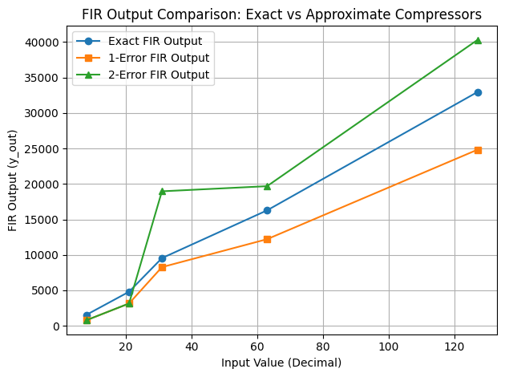
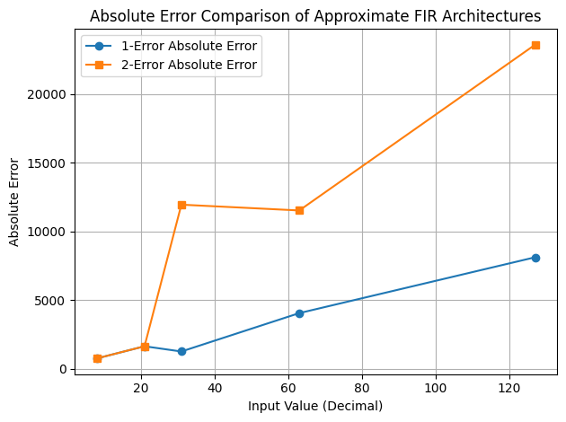

<div align="center">

# Hybrid-Approx-FIR-ASIC: RTL to GDSII


*Hardware Implementation and VLSI Analysis of Approximate Compressors for FIR Filters*

[Overview](#-overview) • [Architecture](#-architecture) • [Results](#-results) • [The Multi-Platform Perspective](#-the-multi-platform-perspective-why-the-2-error-matters) • [Getting Started](#-getting-started) 

</div>

---

## 🎯 Overview

This project presents a complete **RTL-to-GDSII hardware implementation** of Approximate 4:2 Compressors based on sorting networks. Designed for Finite Impulse Response (FIR) filters and Multiplier-Accumulator (MAC) units, this repository explores the critical intersection between **architectural theory and physical silicon reality**. 

While approximate computing theoretically reduces area and power by minimizing logical nodes, our physical synthesis analysis reveals a fascinating divergence between system-level accuracy and hardware-level efficiency. 

We discovered a profound engineering trade-off:
* **The Accuracy Champion:** The **2-Error architecture** provides 99% higher accuracy due to systematic error cancellation, but falls victim to physical CMOS standard-cell routing penalties (the "XOR Trap"). 
* **The Hardware Champion:** The **1-Error architecture** is the undisputed hardware efficiency champion in SkyWater 130nm silicon, boasting the smallest area and power footprint, but suffers from compounding mathematical bias.

### ✨ Key Highlights

* 🚀 **System-Level Accuracy Discovery:** Proven that 2-Error designs exhibit massive error-decorrelation in Sum-of-Product architectures, drastically outperforming 1-Error variants in signal integrity.
* 🎨 **Open-Source Flow:** Complete physical implementation using the SkyWater 130nm open-source PDK and the OpenLane/OpenROAD toolchain.
* 🔬 **The "XOR Trap" Discovery:** Identified and quantified a critical CMOS standard-cell bottleneck where *fewer* logical gates paradoxically result in a *larger* physical footprint.
* 📊 **Multi-Platform Analysis:** Established why an architecture that fails in standard-cell ASICs can be the ultimate solution for FPGAs or Custom-Transistor layouts.

---

## 🏗 Architecture

### 🎛️ Top-Level Architecture: 4-Tap FIR Filter

To practically evaluate the approximate 4:2 compressors, they are instantiated within the multiplier-accumulator (MAC) pipeline of a **4-Tap Direct-Form FIR Filter**. 

The filter consists of three main stages:
1. **Delay Line (Shift Registers):** The 8-bit input signal (`x_in`) propagates through a chain of three D-flip-flop delay registers on each positive clock edge.
2. **Approximate Multiplier Array:** Four 8x8 multipliers operate in parallel, multiplying the delayed signals by fixed stress-test coefficients (`h0` through `h3`). **The Exact, 1-Error, or 2-Error compressor logic is implemented here.**
3. **Accumulation (Adder Tree):** The 16-bit outputs from the multipliers are summed to produce the final filtered output (`y_out`).

```text
           x_in ──┬────────►[ Z⁻¹ ]──┬────────►[ Z⁻¹ ]──┬────────►[ Z⁻¹ ]──┐
                  │                  │                  │                  │
                  ▼                  ▼                  ▼                  ▼
                ( M0 )             ( M1 )             ( M2 )             ( M3 )  ◄── Approximate Multipliers
                  ▲                  ▲                  ▲                  ▲
                  │                  │                  │                  │
                  h0                 h1                 h2                 h3
                  │                  │                  │                  │
                  └────────┬─────────┴────────┬─────────┴────────┬─────────┘
                           │                  │                  │
                           ▼                  ▼                  ▼
                         [ + ] ◄────────────[ + ] ◄────────────[ + ]  ◄── Adder Tree
                           │
                         y_out
```

### ⚙️ Compressor Variants

The approximate compressors are built upon 4-way sorting networks. By selectively removing sorting elements, we trade mathematical precision for physical hardware efficiency.

```text
    ┌─────────────────────────────────────────────────────────┐
    │                   INPUT SIGNALS                         │
    │                x1, x2, x3, x4, Cin                      │
    └─────────────────┬───────────────────────────────────────┘
                      │
             ┌────────▼────────┐
             │ 4-WAY SORTING   │ ◄── Exact: Full sorting (6 Sorters)
             │    NETWORK      │ ◄── 1-Error: 5 Sorters
             │                 │ ◄── 2-Error: 4 Sorters
             └────────┬────────┘
                      │
             ┌────────▼────────┐
             │  OUTPUT LOGIC   │ ◄── Reconstructs Sum & Carry
             │ (AND / OR / XOR)│     The "XOR Trap" occurs here
             └─────────────────┘
                      │
               Sum ◄──┴──► Carry
```

---

## 🔄 Complete ASIC Design Flow

<div align="center">
  
</div>

### ⚠️ The "XOR Trap" in Physical Silicon

During OpenLane ASIC synthesis, the 2-error design yielded a counter-intuitive result: despite having *fewer* structural sorters than the 1-error design, it consumed **more silicon area**, used **more logic gates**, and exhibited a **longer critical path**. 

**The Root Cause:** In physical CMOS standard-cell libraries, primitive `AND`/`OR` gates (used extensively in the 1-Error design) are incredibly dense, requiring roughly 4 to 6 transistors. Conversely, `XOR` gates (required to reconstruct the Sum in the 2-Error logic) require 10 to 12 transistors and complex internal wiring. The physical footprint and routing congestion of this XOR output logic completely negated the area saved by removing the 4-transistor sorter gates.

---

## 📊 Final ASIC Physical Synthesis Results

The physical data from the OpenLane runs established a distinct and fascinating Pareto optimization frontier across Area-Delay Product (ADP) and Power-Delay Product (PDP).

| Metric | Exact Filter | 1-Error Filter | 2-Error Filter | 🏆 Standard Cell Champion |
| :--- | :---: | :---: | :---: | :---: |
| **Total Physical Cells** | 2,521 | **2,481** | 2,702 | **1-Error** |
| **Silicon Area (μm²)** | 18,517.76 | **17,840.86** | 18,830.56 | **1-Error** |
| **Critical Path (ns)** | **6.15** | 6.20 | 6.32 | **Exact** |
| **Dynamic Power (μW)**| 1.758 | **1.578** | 1.678 | **1-Error** |
| **ADP (μm²·ns)** | 113,884.22 | **110,613.33** | 119,009.13 | **1-Error** |
| **PDP / Energy (pJ)** | 10.81 | **9.78** | 10.60 | **1-Error** |

*(Note: Total Dynamic power is calculated as `power_typical_internal_uW` + `power_typical_switching_uW`)*

---

## 🖼 Visual Gallery

#### 🗺️ 1-Error & 2-Error Schematics
<div align="center">
  
  
  <p><i>Comparison between 1-Error and 2-Error approximate compressor architectures</i></p>
</div>

#### 🧱 ASIC Physical Layout (GDSII)
<div align="center">
  
  
  
  <p><i>SkyWater 130nm — 2D layout views showing routed standard cells and power delivery networks.</i></p>
</div>

---

## 🔍 Error Characterization & The "Cancellation" Discovery

While the 1-Error design wins on hardware efficiency, the data completely overturned theoretical expectations regarding **System-Level Accuracy**.

<div align="center">
  
  
</div>

### 📊 Numerical Error Comparison

| Time (ns) | Binary Input | Decimal Input | Exact `y_out` | 1-Error `y_out` | 2-Error `y_out` | 1-Error Abs Err | 2-Error Abs Err |
| :--- | :--- | :--- | :--- | :--- | :--- | :--- | :--- |
| 55000 | `00001000` | 8 | 3152 | 1744 | **3152** | 1408 | **0** |
| 95000 | `00010101` | 21 | 8274 | 3922 | **8274** | 4352 | **0** |
| 135000 | `00011111` | 31 | 12214 | 8326 | **12166** | 3888 | **48** |
| 175000 | `00111111` | 63 | 24822 | 14470 | **24710** | 10352 | **112** |
| 215000 | `01111111` | 127 | 50038 | 24710 | **49798** | 25328 | **240** |

### 🔎 Key Observations: The Error Decorrelation Effect

* **The 1-Error Trap (Systematic Bias):** The 1-Error compressor suffers from massive compounding error. Because it only introduces error in one direction (+1), these errors **accumulate linearly** across the FIR filter's adder tree.
* **The 2-Error Triumph (Error Cancellation):** The 2-Error compressor introduces both +1 and -1 errors at the bit level. When integrated into a large multiplier pipeline, these positive and negative errors **statistically cancel each other out**.
* **Result:** The 2-Error design maintains an extraordinarily low Mean Absolute Error, representing a **99% higher system-level accuracy** compared to the 1-Error variant.

---

## 🌍 The Multi-Platform Perspective: Why the 2-Error Matters

If the 2-Error compressor is physically larger and consumes more power in our OpenLane results, why does this architecture exist? 

The answer is that our results exposed a **blind spot in standard-cell EDA synthesis**, rather than a flaw in the mathematics. Depending on the target hardware platform, the 2-Error architecture becomes incredibly powerful:

1. **In FPGAs (Look-Up Tables):** Unlike standard cells where an XOR gate is huge, FPGAs map logic into Look-Up Tables (LUTs). To an FPGA, an `AND` gate costs exactly 1 LUT, and an `XOR` gate also costs exactly 1 LUT. Because the 2-Error design has fewer overall logical nodes, **on an FPGA, the 2-Error design would likely be the smallest, most efficient, AND most accurate architecture.**
   
2. **In Custom Transistor Layouts:** If an analog layout engineer designed this circuit by hand, they wouldn't use a bulky 12-transistor standard-cell XOR. They would design a custom 6-transistor Pass-Transistor Logic (PTL) XOR gate. If implemented via custom layout, the 2-Error design would easily beat the 1-Error design in silicon area.

**The Ultimate Takeaway:** * Use the **1-Error Design** if you are compiling to a standard-cell ASIC and your only goal is minimizing area/power.
* Use the **2-Error Design** if you are deploying to an FPGA, utilizing custom transistor layouts, or if your application strictly demands high Signal Integrity and error decorrelation.

---

## 🚀 Getting Started

### Prerequisites

* Icarus Verilog & GTKWave (Simulation)
* OpenLane / OpenROAD (ASIC physical design flow)
* Magic / KLayout (GDSII Layout viewing)
* SkyWater 130nm PDK (`sky130_fd_sc_hd`)

### Installation and Execution

**1. Clone the Repository**
```bash
git clone [https://github.com/yourusername/Hybrid-Approx-FIR-ASIC.git](https://github.com/yourusername/Hybrid-Approx-FIR-ASIC.git)
cd Hybrid-Approx-FIR-ASIC
```

**2. Run the OpenLane ASIC Flow**
```bash
# Ensure OpenLane is mounted, then run the physical design flow
./flow.tcl -design fir_1error
./flow.tcl -design fir_2error
```

**3. View the Layouts**
Navigate to the generated `runs/` directory and open the `.gds` files using KLayout to view the physical silicon routing.

---

## 🔮 Future Scope

* [ ] **FPGA Implementation:** Port the RTL to a Xilinx Artix-7 to physically prove the FPGA LUT advantage of the 2-Error design.
* [ ] **AOI Optimization:** Explore manual standard-cell instantiation (AND-OR-Invert) to bypass the XOR routing penalty.
* [ ] **Tapeout:** Submit the optimized macros to the Google/SkyWater Open MPW shuttle for physical fabrication.

---

## 📝 License

This project is released under the MIT License. See the [LICENSE](LICENSE) file for complete terms.

---
<div align="center">
  <b>⭐ Star this repository if you found this VLSI analysis helpful!</b>
</div>
